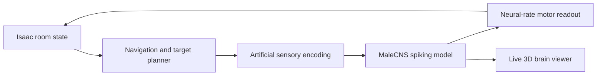

https://github.com/user-attachments/assets/3cf884dc-fb61-4d5e-a84a-ed9496528a85

# Droffel

A virtual fruit-fly nervous system playing **The Binding of Isaac**, with a live 3D view of neural activity.

Droffel connects Isaac's room state to an approximate spiking model built from the **MaleCNS v1.0** connectome. You can watch the controller explore, fight, collect items and respond to sensory stimulation while the same running model lights up in the brain viewer.

## What it does

- Runs 165,122 neurons and 25,563,096 directed, aggregated connections.
- Shows measured cell-body positions for 140,024 neurons and selected real neuron arbors in 3D.
- Controls movement and tears through a local Isaac mod; no screen scraping or global keyboard injection.
- Avoids rocks, pits, spikes and fire; breaks poop blocking a firing lane and extinguishes tear-destructible fire.
- Collects free pickups, buys affordable shop items, and can use a charged active item or a held card during combat.
- Starts another attempt after a game-over while control remains enabled.
- Offers adaptive tactics or a **no-learning mode** that never reads or writes accumulated experience.

## Quick start · Windows

You need Python 3.11 or newer and a mod-capable installation of Isaac. The current integration is tested with Repentance+; older editions are not verified.

```powershell
py -3.11 -m venv .venv
.venv\Scripts\python.exe -m pip install -r requirements.txt
.venv\Scripts\python.exe -m pip install -r requirements-gpu.txt
.venv\Scripts\python.exe tools\prepare_assets.py
Copy-Item game_paths.example.json game_paths.json
```

Edit `game_paths.json` to point to the folder containing `isaac-ng.exe`. Asset preparation downloads the pinned Godot runtime and public MaleCNS data, then builds the local graph and viewer assets. Allow several GB of free disk space. CUDA acceleration is optional; CPU fallback is available, but the full model may run below real time.

| Launcher | Behaviour |
| --- | --- |
| `START_ISAAC.cmd` | Loads and updates learned tactics and room-risk costs. |
| `START_ISAAC_NO_MEMORY.cmd` | Uses fixed tactics; accumulated experience is neither read nor changed. |

Start a run, then press **F6** to enable fly control. **F7** stops it. **Esc** pauses the game and stops control. The launcher installs only Droffel's own mod folder. Restart Isaac through the launcher after updating the mod.

The dashboard opens a separate 3D brain window. Drag to rotate, use the wheel to zoom, and try the stimulus buttons to inspect sensory responses. The original flight-terrain prototype is not part of this release.

## How the controller works



This is a **hybrid controller**, not a trained biological fly that understands a video game. Room coordinates come from the mod. Navigation, targeting, item decisions and sensory mappings are engineered. Neural firing rates gate movement and shooting, and recurrent escape-circuit activity alters evasion. Synaptic weights stay fixed; the optional learning layer adapts tactical choices and spatial risk costs. It does not train the whole connectome.

The model uses simplified leaky integrate-and-fire neurons and assumptions about neurotransmitter signs. The 3D display shows recorded anatomy where available; activity is simulated, not measured from a living animal. Item use is a general combat heuristic rather than complete knowledge of every Isaac item, card or synergy.

## Development

```powershell
.venv\Scripts\python.exe -m pip install -r requirements-dev.txt
.venv\Scripts\python.exe -m pytest tests -q
```

The data-free tests cover controller behaviour, local bridge safeguards, Lua input handling, learning isolation and neural-kernel direction. Generated connectomes, recordings, logs, saved experience, local paths and connection tokens are excluded from git.

See [third-party sources and attribution](THIRD_PARTY.md). MaleCNS data is prepared from the [public FlyEM release](https://storage.googleapis.com/flyem-male-cns/index.html); the simulator is derived from [virtual-fly-lab](https://github.com/Leon-Av/virtual-fly-lab). Isaac integration follows the [Repentance Lua API](https://wofsauge.github.io/IsaacDocs/rep/).

